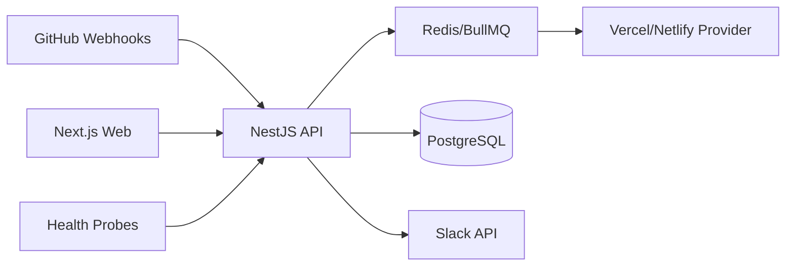

# DevInfra OpsHub — GitOps Control Plane

Turn **GitHub PRs** into **per-PR preview environments** (Vercel/Netlify), manage **encrypted env vars + rotation**, track **health/uptime**, and get **Slack** alerts — with deploy analytics (**success rate, P95 create time, error taxonomy**).

[](#) [](#) [](#)

## ✨ Features

- **🚀 Per-PR Previews**: Automatic create/teardown via GitHub webhooks → Vercel/Netlify
- **🔐 Secrets & Rotation**: AES-256-GCM encryption at rest, versioning, automated rotation policies
- **💚 Health Monitoring**: OK/DEGRADED state machine, Slack alerts with cooldown, auto-registration
- **📊 Deploy Analytics**: Success rate, P50/P95/P99 metrics, error taxonomy, weekly digest
- **👥 RBAC & Audit**: Organization/Project roles; comprehensive audit logging
- **🔧 Provider Agnostic**: Extensible architecture supporting Vercel, Netlify, and custom providers

## 🏗️ Architecture



### Core Components

- **Web App** (Next.js): React dashboard with TypeScript
- **API** (NestJS): RESTful API with authentication, RBAC, and webhooks
- **Queue** (BullMQ + Redis): Background job processing for deployments
- **Database** (PostgreSQL): Primary data store with Prisma ORM
- **Providers**: Vercel, Netlify, and mock providers for testing
- **Monitoring**: Health checks, analytics, and Slack notifications

## 🚀 Quickstart (Local)

### Prerequisites

- Node.js 18+
- Docker & Docker Compose
- pnpm

### Setup

```bash
# 1) Clone and install
git clone <your-repo>
cd DevInfra-OpsHub
pnpm install

# 2) Environment setup
cp deploy/env.example .env
# Edit .env with your GitHub OAuth credentials

# 3) Start services
docker compose -f deploy/docker-compose.prod.yml up -d

# 4) Database setup
pnpm --filter @opshub/api prisma migrate dev
pnpm --filter @opshub/api prisma db seed

# 5) Start applications
pnpm -w dev

# 6) Visit the app
open http://localhost:3000
```

### Test Login (Development)

For testing without GitHub OAuth:

```bash
# Enable test login
echo "ALLOW_TEST_LOGIN=1" >> .env

# Login as demo user
curl -X POST http://localhost:4000/test/login-as \
  -H "Content-Type: application/json" \
  -d '{"email": "owner@demo.local"}'
```

## 🌐 One-Click Deploy (Hosted)

### Render Blueprint

[](https://render.com/blueprint/new)

1. Click the "Deploy to Render" button above
2. Connect your GitHub repository
3. Configure environment variables (see `deploy/env.example`)
4. Deploy with one click!

### Manual Deploy

See [docs/DEPLOY.md](docs/DEPLOY.md) for detailed deployment instructions.

## 📖 Documentation

- **[Architecture](docs/ARCHITECTURE.md)** - System design and component interactions
- **[Security](docs/SECURITY.md)** - Threat model, encryption, and security practices
- **[Operations](docs/OPERATIONS.md)** - Environment setup, monitoring, and runbooks
- **[API Reference](docs/API.md)** - Complete API documentation with examples
- **[Demo Guide](docs/DEMO.md)** - Step-by-step demonstration scenarios
- **[Troubleshooting](docs/TROUBLESHOOTING.md)** - Common issues and solutions

## 🎬 Demo

### Quick Demo Script

```bash
# 1) Seed demo data
pnpm demo:seed

# 2) Open a PR (simulates GitHub webhook)
pnpm demo:open --repo octocat/Hello-World --pr 42 --branch feature/demo

# 3) Check the dashboard - you'll see:
#    - New preview deployment
#    - Health check auto-created
#    - Slack notification (if configured)

# 4) Close the PR
pnpm demo:close --repo octocat/Hello-World --pr 42

# 5) View analytics and health metrics
```

### Guided Demo Mode

Enable demo mode for guided demonstrations:

```bash
# Set demo mode in .env
echo "DEMO_MODE=1" >> .env
echo "USE_MOCK_PROVIDER=1" >> .env
echo "DISABLE_SLACK=1" >> .env

# Start the application
pnpm dev

# Visit /demo for guided steps
open http://localhost:3000/demo
```

### CLI Demo

```bash
# Build and install CLI
pnpm --filter @opshub/cli build
pnpm link -w

# Login and run demo
opshub login --email owner@demo.local
opshub demo reset
opshub demo open-pr
opshub demo degrade
opshub demo recover
opshub demo close-pr
```

### Screenshots

See [docs/screenshots/](docs/screenshots/) for automated UI screenshots.

## 🛠️ Development

### Project Structure

```
├── apps/
│   ├── web/          # Next.js frontend
│   └── api/          # NestJS backend
├── packages/
│   ├── types/        # Shared TypeScript types
│   └── cli/          # Command-line interface
├── docs/             # Documentation
├── scripts/          # Demo and utility scripts
└── deploy/           # Deployment configurations
```

### Key Scripts

```bash
# Development
pnpm dev              # Start all services
pnpm build            # Build all packages
pnpm test             # Run all tests
pnpm test:e2e         # Run Playwright E2E tests
pnpm test:k6          # Run k6 load tests

# Demo
pnpm demo:seed        # Seed demo data
pnpm demo:open        # Simulate PR opened
pnpm demo:close       # Simulate PR closed
pnpm demo:screens     # Generate screenshots

# CLI
pnpm --filter @opshub/cli build  # Build CLI
pnpm link -w                     # Link CLI globally
opshub --help                    # Show CLI help

# Database
pnpm db:migrate       # Run migrations
pnpm db:seed          # Seed database
```

## 🔧 Configuration

### Environment Variables

See [deploy/env.example](deploy/env.example) for complete configuration options.

### Required Variables

- `DATABASE_URL` - PostgreSQL connection string
- `REDIS_URL` - Redis connection string
- `JWT_SECRET` - JWT signing secret
- `ENCRYPTION_KEY_BASE64` - 32-byte base64 encryption key
- `GITHUB_CLIENT_ID` - GitHub OAuth client ID
- `GITHUB_CLIENT_SECRET` - GitHub OAuth client secret

### Optional Variables

- `ALLOW_TEST_LOGIN` - Enable test login (development only)
- `DISABLE_SLACK` - Disable Slack notifications (testing)
- `USE_MOCK_PROVIDER` - Use mock provider (testing)

## 🤝 Contributing

1. Fork the repository
2. Create a feature branch
3. Make your changes
4. Add tests for new functionality
5. Submit a pull request

## 📄 License

MIT License - see [LICENSE](LICENSE) for details.

## 🙏 Acknowledgments

Built with:
- [Next.js](https://nextjs.org/) - React framework
- [NestJS](https://nestjs.com/) - Node.js framework
- [Prisma](https://prisma.io/) - Database ORM
- [BullMQ](https://bullmq.io/) - Queue processing
- [Playwright](https://playwright.dev/) - E2E testing
- [k6](https://k6.io/) - Load testing

---

**Ready to deploy?** Check out the [Demo Guide](docs/DEMO.md) for a complete walkthrough! 🚀