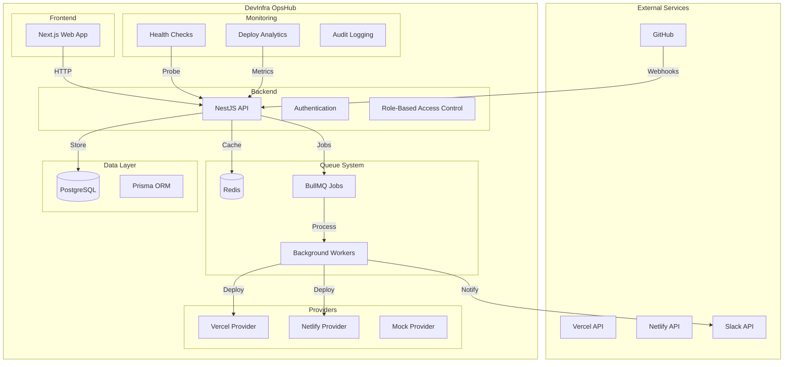
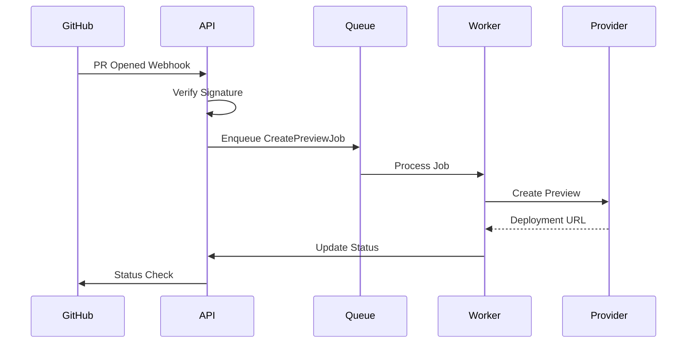
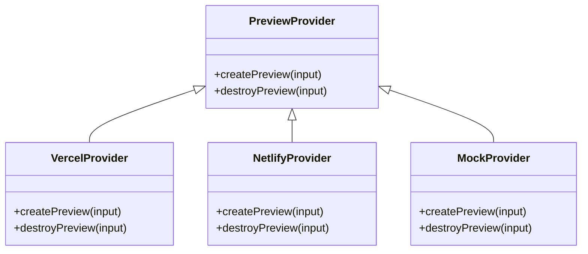
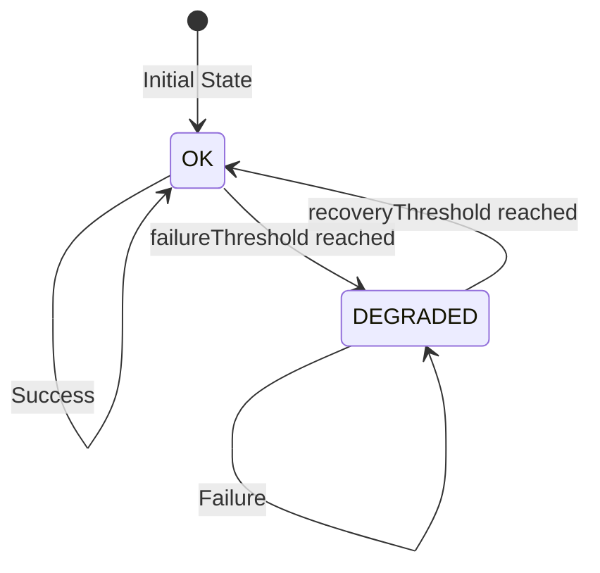
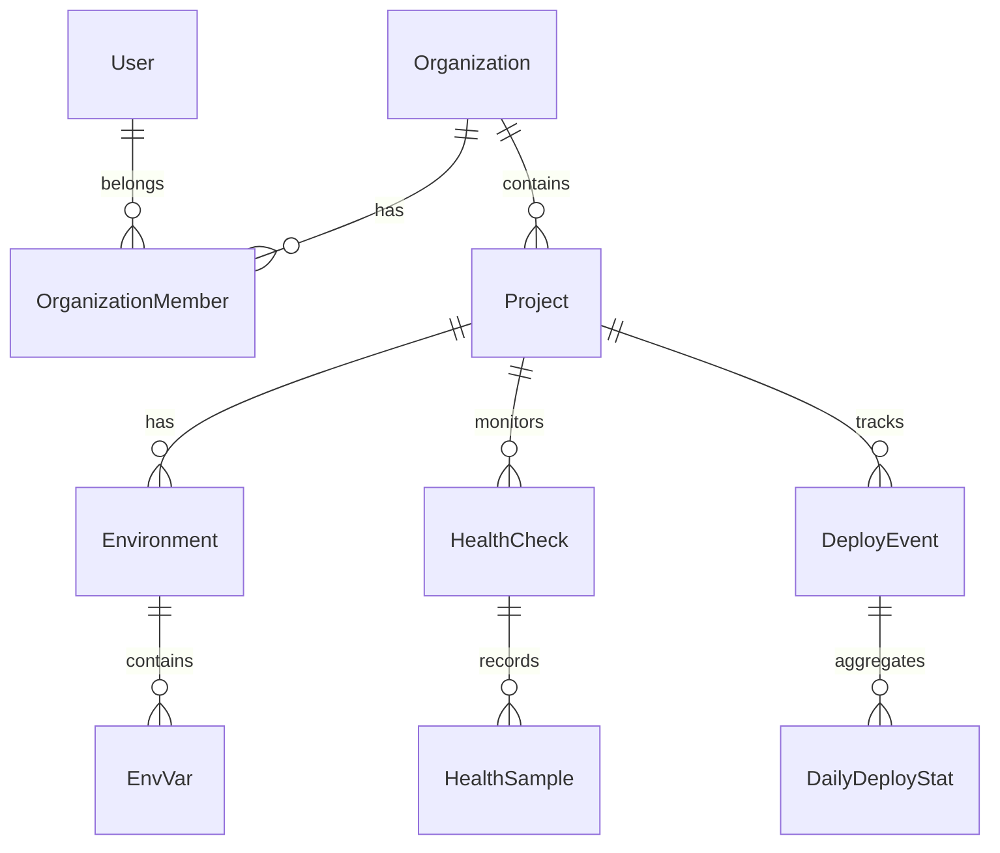
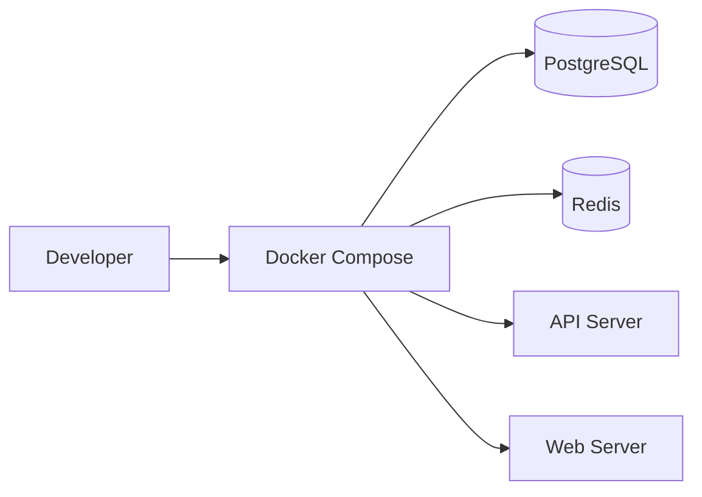
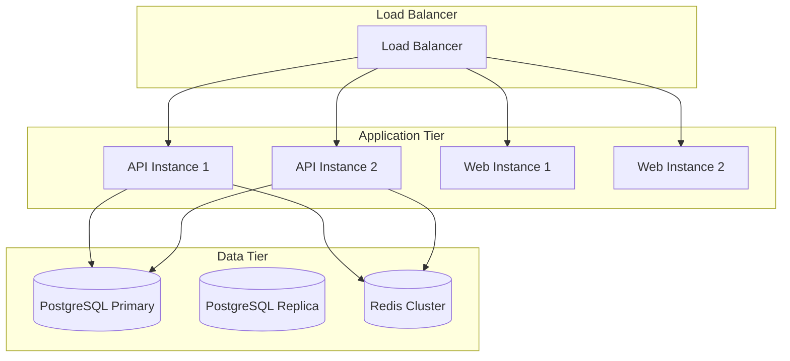

# Architecture

DevInfra OpsHub is a GitOps control plane that automates preview environment management for GitHub pull requests. This document outlines the system architecture, component interactions, and data flow.

## System Overview



## Core Modules

### 1. Authentication & Authorization

**Components:**
- GitHub OAuth integration
- JWT token management
- Role-based access control (RBAC)

**Flow:**
1. User initiates GitHub OAuth flow
2. GitHub redirects with authorization code
3. API exchanges code for access token
4. User profile fetched and stored
5. JWT issued for session management

**RBAC Hierarchy:**
```
Organization Level:
├── Owner (full access)
├── Maintainer (manage projects, settings)
├── Developer (create deployments, manage env vars)
└── Viewer (read-only access)

Project Level:
├── Owner (full project access)
├── Maintainer (manage project settings)
├── Developer (create deployments)
└── Viewer (view project)
```

### 2. Webhook Processing

**Components:**
- GitHub webhook signature verification
- Event parsing and validation
- Job queue integration

**Event Flow:**


### 3. Queue System

**Components:**
- Redis for job storage
- BullMQ for job processing
- Background workers for async operations

**Job Types:**
- `create-preview`: Deploy preview environment
- `tear-down-preview`: Destroy preview environment
- `health-probe`: Execute health checks
- `slack-notify`: Send Slack notifications
- `deploy-analytics`: Aggregate metrics

### 4. Provider System

**Architecture:**


### 5. Environment Management

**Components:**
- Environment variables with AES-256-GCM encryption
- Secret rotation policies
- Version history and audit trails

**Encryption Flow:**
1. User provides plaintext value
2. Generate random IV (12 bytes)
3. Encrypt with AES-256-GCM
4. Store ciphertext, IV, and auth tag separately
5. Mask value in logs and API responses

### 6. Health Monitoring

**Components:**
- Configurable health checks
- State machine (OK/DEGRADED)
- Alert cooldown and throttling
- Auto-registration for preview deployments

**State Machine:**


### 7. Analytics & Metrics

**Components:**
- Deploy event tracking
- Daily statistics aggregation
- Performance metrics (P50, P95, P99)
- Error taxonomy and classification

**Data Flow:**
1. Deploy events recorded during lifecycle
2. Hourly aggregation job processes events
3. Daily statistics computed and stored
4. API serves metrics for dashboard
5. Weekly digest sent via Slack

## Data Model

### Core Entities



### Key Relationships

- **Users** belong to **Organizations** with specific roles
- **Projects** belong to **Organizations** and have multiple **Environments**
- **Environments** contain **Environment Variables** (encrypted)
- **Health Checks** monitor endpoints and record **Samples**
- **Deploy Events** track the lifecycle of preview deployments
- **Daily Deploy Stats** aggregate metrics for analytics

## Security Architecture

### Threat Model

**Primary Threats:**
1. **Unauthorized Access**: Mitigated by RBAC and JWT authentication
2. **Secret Exposure**: Mitigated by AES-256-GCM encryption and masking
3. **SSRF Attacks**: Mitigated by URL validation and allowlisting
4. **Webhook Spoofing**: Mitigated by signature verification
5. **Data Breaches**: Mitigated by encryption at rest and in transit

### Security Controls

- **Authentication**: GitHub OAuth + JWT sessions
- **Authorization**: Role-based access control
- **Encryption**: AES-256-GCM for sensitive data
- **Audit**: Comprehensive logging of all mutations
- **Input Validation**: Strict validation and sanitization
- **Rate Limiting**: Protection against abuse

## Scalability Considerations

### Horizontal Scaling

- **API**: Stateless design allows horizontal scaling
- **Queue**: Redis cluster for job distribution
- **Database**: Read replicas for analytics queries
- **Workers**: Multiple worker instances for job processing

### Performance Optimizations

- **Database**: Indexed queries and connection pooling
- **Caching**: Redis for session and job data
- **CDN**: Static assets served via CDN
- **Monitoring**: Health checks and metrics collection

## Deployment Architecture

### Local Development



### Production Deployment



## Monitoring & Observability

### Metrics Collection

- **Application Metrics**: Response times, error rates, throughput
- **Business Metrics**: Deployment success rate, preview creation time
- **Infrastructure Metrics**: CPU, memory, disk usage
- **Custom Metrics**: Health check status, alert frequency

### Logging Strategy

- **Structured Logging**: JSON format with correlation IDs
- **Log Levels**: DEBUG, INFO, WARN, ERROR
- **Audit Logging**: All mutations logged with user context
- **Security Logging**: Authentication and authorization events

### Alerting

- **Health Degradation**: Immediate alerts for service issues
- **Performance**: Alerts for slow response times
- **Errors**: Alerts for high error rates
- **Business**: Weekly digest of deployment metrics

## Future Enhancements

### Planned Features

1. **Multi-Cloud Support**: AWS, GCP, Azure providers
2. **Advanced Analytics**: Machine learning for failure prediction
3. **Cost Optimization**: Resource usage tracking and optimization
4. **Compliance**: SOC2, GDPR compliance features
5. **API Gateway**: Rate limiting and API management

### Technical Debt

1. **Database Migrations**: Automated migration strategies
2. **Testing**: Increased test coverage and integration tests
3. **Documentation**: API documentation and user guides
4. **Monitoring**: Enhanced observability and alerting
5. **Security**: Security scanning and vulnerability management
