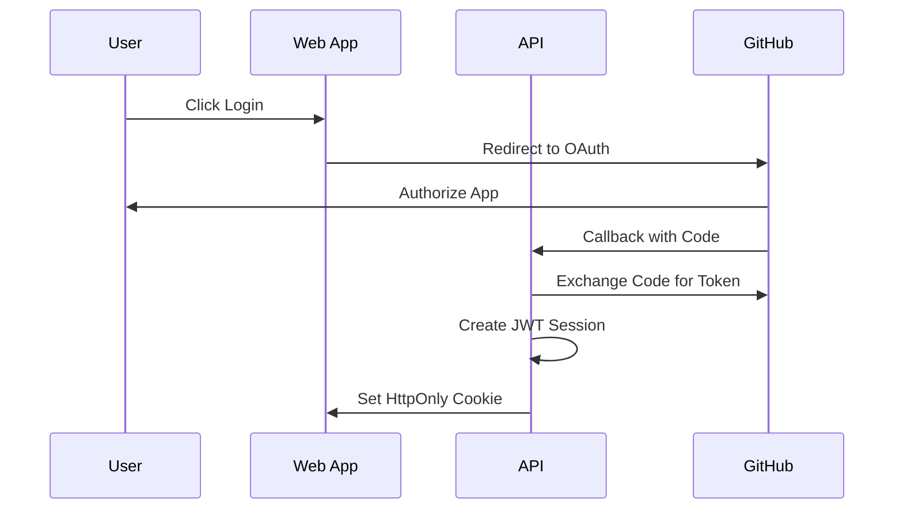

# Security

This document outlines the security architecture, threat model, and security practices for DevInfra OpsHub.

## Threat Model

### Primary Threats

1. **Unauthorized Access**
   - **Risk**: Malicious users gaining access to sensitive data
   - **Mitigation**: GitHub OAuth + JWT authentication, RBAC authorization

2. **Secret Exposure**
   - **Risk**: Environment variables and API keys exposed in logs or storage
   - **Mitigation**: AES-256-GCM encryption, value masking, secure storage

3. **SSRF Attacks**
   - **Risk**: Health check URLs used to attack internal services
   - **Mitigation**: URL validation, HTTPS enforcement, IP allowlisting

4. **Webhook Spoofing**
   - **Risk**: Malicious webhook payloads bypassing signature verification
   - **Mitigation**: HMAC signature verification, payload validation

5. **Data Breaches**
   - **Risk**: Sensitive data exposed through database or API
   - **Mitigation**: Encryption at rest, secure transmission, access controls

## Security Architecture

### Authentication

**GitHub OAuth Flow:**


**Security Features:**
- HttpOnly cookies prevent XSS attacks
- JWT tokens with expiration
- Secure cookie settings (HTTPS, SameSite)
- Session invalidation on logout

### Authorization

**Role-Based Access Control (RBAC):**

```typescript
// Organization Level Roles
enum OrgRole {
  OWNER = 'OWNER',           // Full organization access
  MAINTAINER = 'MAINTAINER', // Manage projects and settings
  DEVELOPER = 'DEVELOPER',   // Create deployments and manage env vars
  VIEWER = 'VIEWER'         // Read-only access
}

// Project Level Permissions
interface ProjectPermissions {
  read: boolean;
  write: boolean;
  deploy: boolean;
  manage: boolean;
}
```

**Permission Matrix:**
| Action | Owner | Maintainer | Developer | Viewer |
|--------|-------|------------|-----------|--------|
| View Project | ✅ | ✅ | ✅ | ✅ |
| Create Deployment | ✅ | ✅ | ✅ | ❌ |
| Manage Env Vars | ✅ | ✅ | ✅ | ❌ |
| Manage Settings | ✅ | ✅ | ❌ | ❌ |
| Delete Project | ✅ | ❌ | ❌ | ❌ |

### Encryption

**Environment Variable Encryption:**

```typescript
// AES-256-GCM Encryption
interface EncryptedData {
  iv: Buffer;        // 12-byte random IV
  ciphertext: Buffer; // Encrypted data
  tag: Buffer;       // Authentication tag
}

// Encryption Process
1. Generate random 12-byte IV
2. Create AES-256-GCM cipher with key and IV
3. Set additional authenticated data (AAD)
4. Encrypt plaintext
5. Get authentication tag
6. Store IV, ciphertext, and tag separately
```

**Key Management:**
- Encryption key stored in `ENCRYPTION_KEY_BASE64` environment variable
- 32-byte (256-bit) key required
- Key rotation requires re-encryption of all data
- Keys should be generated using cryptographically secure methods

### Data Protection

**Sensitive Data Handling:**
- Environment variables encrypted with AES-256-GCM
- API keys and tokens masked in logs
- Database connections use SSL/TLS
- Redis connections use AUTH and TLS

**Data Masking:**
```typescript
// Value masking for logs and API responses
function maskValue(value: string): string {
  if (!value) return '••••';
  if (value.length < 8) return '••••';
  return '••••••' + value.slice(-4);
}
```

### Input Validation

**Webhook Security:**
```typescript
// GitHub webhook signature verification
function verifyWebhookSignature(payload: string, signature: string): boolean {
  const expectedSignature = crypto
    .createHmac('sha256', webhookSecret)
    .update(payload)
    .digest('hex');
  
  return crypto.timingSafeEqual(
    Buffer.from(signature),
    Buffer.from(expectedSignature)
  );
}
```

**URL Validation:**
```typescript
// Health check URL validation
function validateHealthCheckUrl(url: string): boolean {
  // Must be HTTPS
  if (!url.startsWith('https://')) return false;
  
  // Block private IP ranges
  const privateRanges = [
    /^https:\/\/localhost/,
    /^https:\/\/127\.0\.0\.1/,
    /^https:\/\/10\./,
    /^https:\/\/172\.(1[6-9]|2[0-9]|3[0-1])\./,
    /^https:\/\/192\.168\./
  ];
  
  return !privateRanges.some(pattern => pattern.test(url));
}
```

## Security Controls

### Network Security

**HTTPS Enforcement:**
- All API endpoints require HTTPS in production
- Health check URLs must use HTTPS
- Webhook endpoints use HTTPS
- Cookie security with Secure flag

**CORS Configuration:**
```typescript
// CORS settings
const corsOptions = {
  origin: process.env.WEB_BASE_URL,
  credentials: true,
  optionsSuccessStatus: 200
};
```

### Database Security

**Connection Security:**
- SSL/TLS encryption for database connections
- Connection pooling with limits
- Prepared statements to prevent SQL injection
- Database user with minimal required permissions

**Data Encryption:**
- Sensitive fields encrypted at application level
- Database-level encryption for data at rest
- Regular security updates and patches

### API Security

**Rate Limiting:**
```typescript
// Rate limiting configuration
const rateLimitOptions = {
  windowMs: 15 * 60 * 1000, // 15 minutes
  max: 100, // limit each IP to 100 requests per windowMs
  message: 'Too many requests from this IP'
};
```

**Request Validation:**
- All inputs validated using class-validator
- SQL injection prevention with Prisma ORM
- XSS prevention with input sanitization
- CSRF protection with SameSite cookies

### Audit Logging

**Comprehensive Audit Trail:**
```typescript
interface AuditLog {
  actorUserId: string;
  projectId?: string;
  action: string;
  metadataJson: Record<string, any>;
  createdAt: Date;
}
```

**Logged Actions:**
- User authentication and authorization
- Project and organization management
- Environment variable changes
- Health check modifications
- Deployment operations
- Security-related events

## Security Best Practices

### Development

**Secure Coding:**
- Input validation and sanitization
- Output encoding to prevent XSS
- Secure error handling without information disclosure
- Regular dependency updates and vulnerability scanning

**Code Review:**
- Security-focused code reviews
- Automated security scanning
- Penetration testing for critical components
- Regular security training for developers

### Deployment

**Environment Security:**
- Secure environment variable management
- Secrets management with proper rotation
- Network segmentation and firewall rules
- Regular security updates and patches

**Monitoring:**
- Security event monitoring
- Anomaly detection and alerting
- Regular security assessments
- Incident response procedures

### Operations

**Access Control:**
- Principle of least privilege
- Regular access reviews and audits
- Multi-factor authentication for admin access
- Secure key management and rotation

**Data Protection:**
- Regular backups with encryption
- Data retention policies
- Secure data disposal procedures
- Compliance with data protection regulations

## Compliance

### Data Protection

**GDPR Compliance:**
- No personal data stored beyond GitHub profile
- User data deletion on request
- Data processing transparency
- Consent management for data collection

**SOC 2 Compliance:**
- Security controls documentation
- Regular security assessments
- Incident response procedures
- Vendor management and monitoring

### Security Standards

**OWASP Top 10:**
- A01: Broken Access Control - Mitigated by RBAC
- A02: Cryptographic Failures - Mitigated by AES-256-GCM
- A03: Injection - Mitigated by Prisma ORM
- A04: Insecure Design - Mitigated by threat modeling
- A05: Security Misconfiguration - Mitigated by secure defaults
- A06: Vulnerable Components - Mitigated by dependency scanning
- A07: Authentication Failures - Mitigated by GitHub OAuth
- A08: Software Integrity - Mitigated by signature verification
- A09: Logging Failures - Mitigated by comprehensive audit logging
- A10: SSRF - Mitigated by URL validation

## Incident Response

### Security Incident Procedures

1. **Detection**: Automated monitoring and alerting
2. **Assessment**: Impact and severity evaluation
3. **Containment**: Immediate threat isolation
4. **Eradication**: Root cause identification and removal
5. **Recovery**: System restoration and validation
6. **Lessons Learned**: Post-incident review and improvement

### Contact Information

- **Security Team**: security@opshub.dev
- **Incident Response**: incident@opshub.dev
- **Bug Bounty**: security@opshub.dev

## Security Updates

### Regular Updates

- **Dependencies**: Weekly security updates
- **Infrastructure**: Monthly security patches
- **Application**: Continuous security improvements
- **Documentation**: Quarterly security review

### Vulnerability Management

- **Disclosure**: Responsible disclosure process
- **Assessment**: Risk-based vulnerability prioritization
- **Remediation**: Timely security fix deployment
- **Communication**: Transparent security updates

---

For security concerns or to report vulnerabilities, please contact security@opshub.dev.
